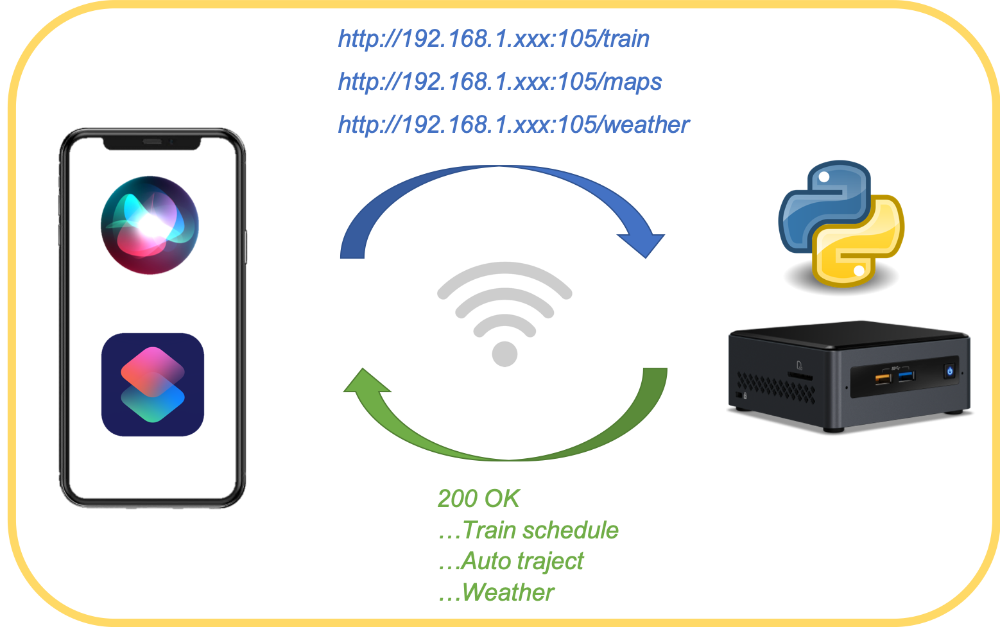
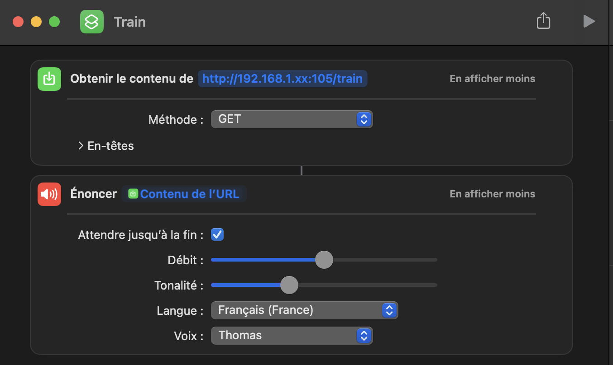

# Morning Dashboard with Siri
## About 

The Morning Dashboard with Siri allows the user to have an overview of some practical important information at the beginning of his day:
1. Train schedule to his workplace
2. Auto traject simulation to his workplace (to be debated with the train option)
3. Weather at the moment at his location
   
The Morning Dashboard can be consulted by the user on his iPhone, by activating a shortcut (manually or asking Siri). The iPhone then gives an oral announcement of the partial or complete dashboard. This saves the time to launch the separate apps and search for information. The morning dashboard can be called by asking Siri for example while dressing or eating.

This project has been implemented as part of the final project of the open course [CS50’s Introduction to Programming with Python](https://cs50.harvard.edu/python/2022/project/).

## Script architecture

The script is written in Python, using the Flask framework to implement a webserver. The user, via his iPhone (considered as the client), can send http requests to the webserver in order to get the data of the dashboard.

The http request has the following structure:
> http://\<IP address of the server>:\<Port>/\<Part of the dashboard>

The IP address is an address configured on the Ethernet card of the server on which the script is running. This server can be for example a local Linux computer, allocated to domotic, powered 24/7, and always ready to receive the requests.

The Port used is 8000, but this can configurable in the script.

The Part of the dashboard element in the request refers either to the train schedule (/train), the auto traject (/maps) or the weather (/weather). For this purpose, the Flask decorator `@app.route(‘/’)` is used before each function to call it automatically for that part of the dashboard.

The `get_data(topic)` function inside called in each function. It contains the URL's used for the API calls, which are sent to the respective API's by using the `requests` library. Note that for this published code, the different URL's have been removed because they contained private API keys. Instead, the needed data has been hardcoded in json files (namely `train.json`, `maps.json` and `weather.json`), stored in the same folder as the project script. The user may of course replace variables `url_train`, `url_maps` and `url_weather` by his own URL strings and use the http response as data afterwards instead of these coming from the json files. 

## Train schedule

This part explains the `train()` function.

The national Belgian Rail company SNCB/NMBS provides online real-time data, on train schedule, updated every 30 seconds, under the form of a GTFS feed. The project [GTFS Realtime Bindings](https://github.com/MobilityData/gtfs-realtime-bindings/tree/ffe13e9b63436812bef91163a4c3698b07b2dfc7/python/google/transit) allows downloading a GTFS-realtime data feed from a particular URL and parsing it as a FeedMessage (the root type of the GTFS-realtime scheme).

The GTFS data is usually encoded and decoded using the [Protocol Buffers](https://protobuf.dev). To decode the data in the script, we import the [Protobuf-to-dict](https://github.com/benhodgson/protobuf-to-dict) library and use the `protobuf_to_dict()` function to transform the feed into a Python dictionary.

Once the data is transformed, a regular expression is used to search for a stop of interest (for example: Schaerbeek) in the data. The stops of interest are hardcoded in a dictionary called `stops`. Once found, some loops are used to search in the dictionary for items like `trip_update`, `stop_time_update`, `departure`, `delay`, etc. 

Finally, a string (in French) is built based on the above data to announce the information about the next trains to the user on his iPhone. In this usecase, the start and stop locations are respectively Ecaussinnes and Schaerbeek (Belgium) but these can be easily adapted.

Note: In the published code, the needed commands to deal with the GTFS feed are commented (in the `get_data()` function) but can be used if the user wants to use his own URL to a feed.

## Auto traject
This part explains the `map()` function in the code.

In this function, we call the REST API of Bing Maps in order to create a route going to the workplace of the user and giving an estimation of the travel time, by car. To do that, the `get_data(topic)` is called and via the `requests` library, we make a GET request to the API. Then, we extract the data from the response and store it in a dictionary. 

By looking at the dictionary keys, useful data can be found as the `distance`, `congestion` and `travel` duration. These are put in a string that is then returned to the user by the function.

In this usecase, the start and stop locations are respectively Ecaussinnes and Schaerbeek (Belgium) but these can be easily adapted.

## Weather
This part explains the `weather()` function in the code.

In this function, we call the REST API of [OpenWeatherMap](https://openweathermap.org) to get information about the current weather. As for the `map()` function, the `requests()` function is used to make a GET request to the API (by calling `get_data(topic)`). Then, data is extracted from the respond using the `json()` method and store it in a dictionary.

Finally, the following data are extracted from the dictionary: `minimum temperature`, `maximum temperature`, `humidity` and `wind speed`. These are put in a string that is then returned to the user by the function.

In this usecase, the location is set to Ecaussinnes (Belgium) but can be easily adapted.

## Siri shortcut
An example of shortcut that can be implemented on an iOS device is given in the following. A GET method is used with an URL to call containing the IP address of the server as well as the route to the needed function.

## Video
[Youtube](https://youtu.be/SlZm5eu4wuI)